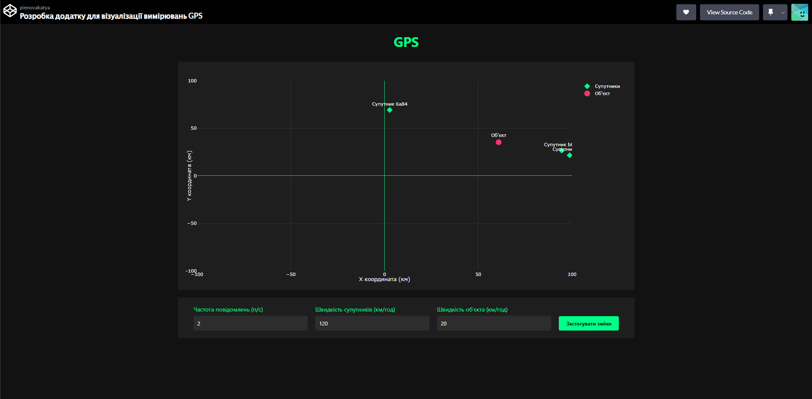
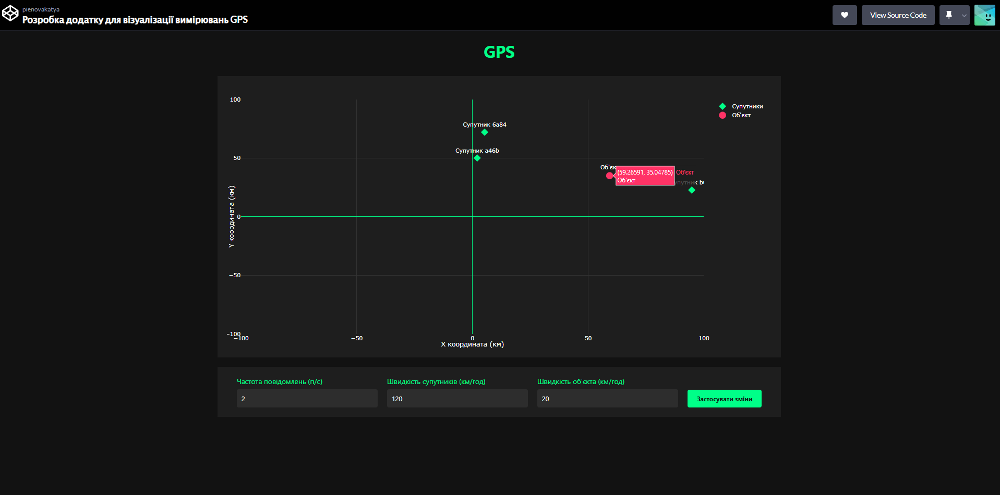
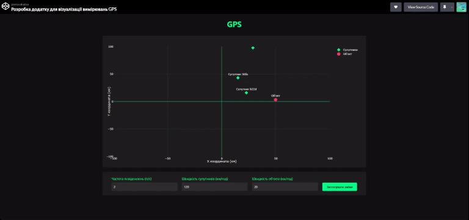

<h1 align="center">Звіт з лабораторної роботи №5</h1>
<h2 align="center">Розробка додатку для візуалізації вимірювань GPS</h2>

## Мета роботи
Розробити веб-додаток для візуалізації даних GPS вимірювань в реальному часі з можливістю налаштування параметрів роботи системи через API. Додаток має відображати положення об'єкта та супутників на графіку в декартових координатах.

## Завдання роботи
Створення інтерактивного веб-додатку, що підключається до емульованої вимірювальної частини GPS через WebSocket, обробляє отримані дані та візуалізує розташування об'єкта та супутників з можливістю налаштування параметрів вимірювань.

## Хід роботи

### Базова візуалізація
Розроблений додаток відображає координатну площину з позначеними осями та координатною сіткою для зручного визначення положення об'єктів.

 

Головний інтерфейс програми з відображенням координатної сітки та елементами керування

### Відстеження положення об'єкта
Система в реальному часі оновлює положення об'єкта та супутників. При наведенні на об'єкт відображаються його точні координати.

 

Візуалізація положення об'єкта та супутників з відображенням координат

### Динамічна зміна параметрів
Система дозволяє змінювати ключові параметри роботи GPS:
- Частота повідомлень від супутників
- Швидкість руху супутників
- Швидкість руху об'єкта

 

Демонстрація впливу параметрів на поведінку системи

При збільшенні частоти повідомлень (messageFrequency) спостерігається більш плавне оновлення позицій об'єктів на графіку. Зміна швидкості супутників (satelliteSpeed) впливає на швидкість їх обертання навколо центральної осі, а регулювання швидкості об'єкта (objectSpeed) змінює динаміку його переміщення в просторі. При високих значеннях швидкості рух стає більш динамічним, а при низьких - більш плавним та передбачуваним.

## Висновок
Розроблений додаток успішно виконує поставлені завдання з візуалізації GPS даних та надає зручний інтерфейс для налаштування параметрів роботи. Тестування показало, що система ефективно працює з різними конфігураціями параметрів та здатна відображати динамічні зміни положення об'єктів у реальному часі.
